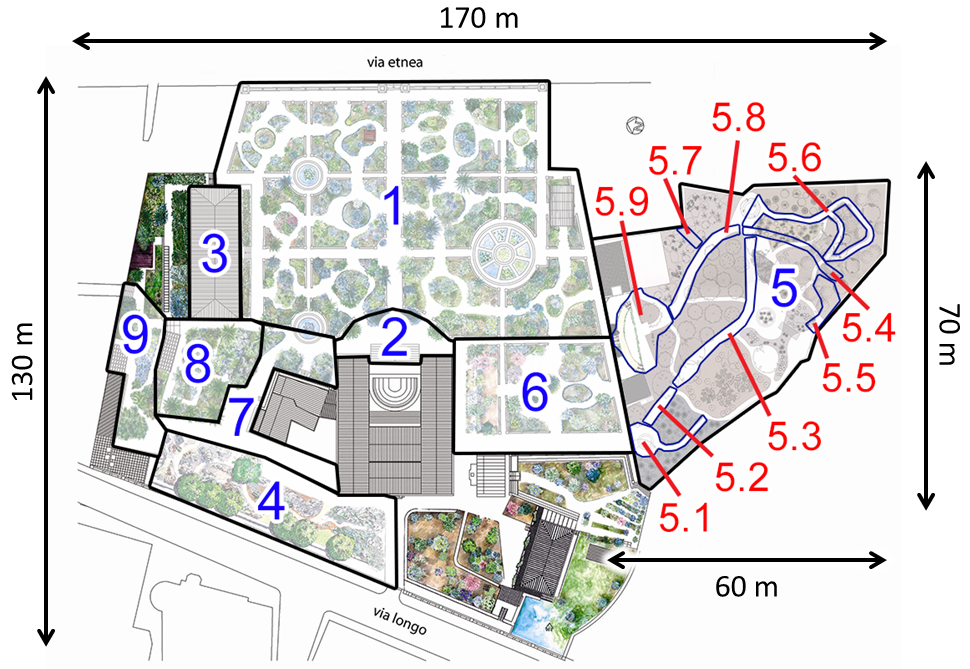
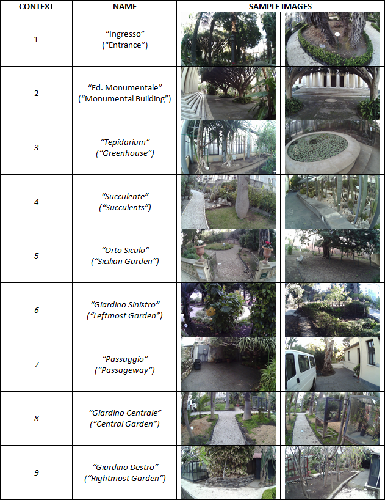
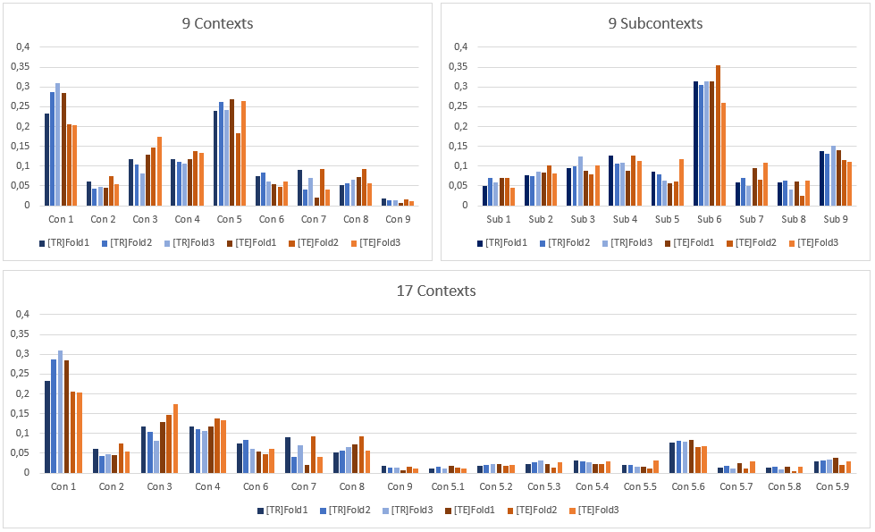
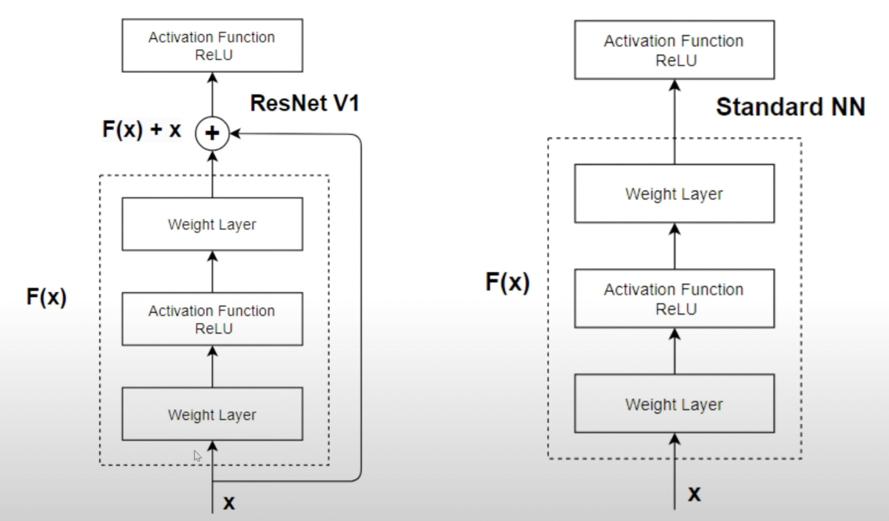
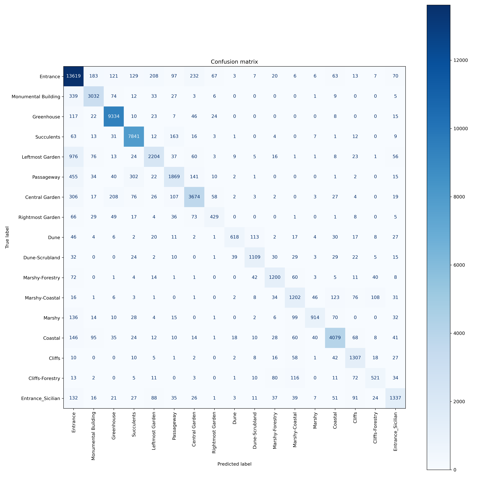
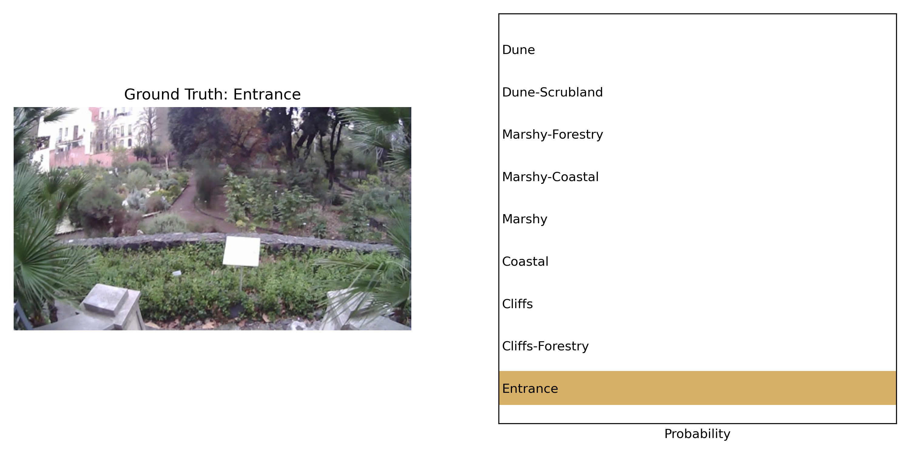
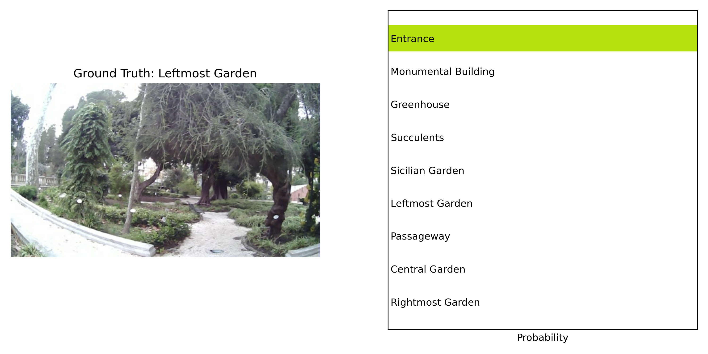

# Relazione Progetto di Machine Learning

**Nome**: *Luca Venerando*

**Cognome**: *Greco*

**Matricola**: *1000016165*

**Corso**: Machine Learning

**Docente**: Giovanni Maria Farinella

**Anno Accademico**: *2022/2023*

## Indice 

1. [Problema](#problema)
2. [Dataset](#dataset)
3. [Metodi](#metodi)
4. [Valutazione](#valutazione)
5. [Esperimenti](#esperimenti)
6. [Demo](#demo)
7. [Codice](#codice)
8. [Conclusioni](#conclusioni)

## Problema

[Extracted from the EgoNature website]

Localizzare i visitatori in ambienti naturali rappresenta una sfida a causa dell'indisponibilità di telecamere preinstallate o di altre infrastrutture come reti WiFi.

La localizzazione può essere utile per fornire servizi sia ai visitatori (ad esempio, mostrando dove si trovano o cosa vedere successivamente) che al gestore del sito (ad esempio, per capire a cosa i visitatori prestano più attenzione e cosa perdono durante le loro visite).

Consideriamo la localizzazione del visitatore del sito naturale come un problema di classificazione. In particolare, si esplorerà un approccio di classificazione basato su immagini.

Ciascuno dei modelli considerati è addestrato e valutato sul dataset EgoNature secondo i tre livelli definiti di granularità della localizzazione: 9 Context, 9 Subcontext e 17 Context-Subcontext

## Dataset

Il Dataset utilizzato in questo progetto è [Egonaure](https://iplab.dmi.unict.it/EgoNature), un dataset di immagini egocentriche di visitatori all'interno dell'orto botanico di Catania.

Il dataset presenta sia immagini egocentriche che dati GPS dei visitatori, ma per lo sviluppo di questo progetto ci limiteremo a considerare le immagini. Il dataset è diviso in 3 livelli di granularità della localizzazione: 9 Context, 9 Subcontext e 17 Context-Subcontext, I 9 contesti rapresentano 9 macroaree dell'orto, i 9 sub-context sono le sottoaree della macroarea "Giardino Siciliano" e i 17 Context-Subcontext sono le combinazioni dei due livelli precedenti, una mappa esplicativa delle aree:



Le immagini si trovano tutte nella stessa cartella insieme ad alcuni file .txt che contengono le classi di appartenza di ciascuna immagine. Oltre ad essere suddiviso per modality è presente anche una divisione in tre fold e uno split fra training e test set. Per ciascuna combinazione di modality, fold e set è presente un apposito file di txt, il cui filename segue la seguente regola:

[train|test]\_[Con|Sub|ConSub]\_[0|1|2].txt
dove:
- [train|test] identifica il set di addestramento o il set di test
- [Con|Sub|ConSub] identifica la modality
- [0|1|2] identifica il fold

Anche le immagini seguono una specifica nomenclatura, in particolare:

yyyy_mm_dd_sessionID_frameID.jpeg

- yyyy è l'anno di registrazione nel formato a 4 cifre
- mm è il mese di registrazione nel formato a 2 cifre
- dd è il giorno di registrazione nel formato a 2 cifre
- sessionID è un ID incrementale giornaliero per le registrazioni, a partire da 000, in un formato a 3 cifre
- frameID identifica un frame del giorno e della sessione corrente

Ulteriori informazioni sul dataset sono disponibili nella [documentazione](https://iplab.dmi.unict.it/EgoNature/dataset.html) del dataset, di seguito alcune informazioni utili estratte dalla documentazione:

Metodo di acquisizione: I volontari sono stati istruiti a visitare tutti i 9 contesti senza alcuna restrizione specifica, potendo trascorrere il tempo che desideravano in ciascun contesto. Durante la visita, abbiamo chiesto ad ogni volontario di esplorare il sito naturale indossando una telecamera e uno smartphone. La telecamera indossabile, un headset Pupil 3D Eye Tracker, è stata utilizzata per raccogliere video egocentrici delle visite, mentre lo smartphone è stato utilizzato per raccogliere informazioni sulla posizione GPS. I video sono stati acquisiti ad una risoluzione di 1280x720 pixel e una frequenza di 60 fps. Di questi, una selezione di 63,581 frames è stata fatta e successivamente downscalata. 

Un estratto del dataset:



Inoltre i video sono stati divisi in modo che i frame di ogni classe fossero distribuiti in modo equo nei diversi fold. La distribuzione dei frame per ogni fold è mostrata nella figura seguente. Gli istogrammi sono stati normalizzati: rappresentano la percentuale di frame per ogni contesto/sottoclasse sul totale per ogni distribuzione riportata. Sono riportati insieme sia il Training Set [TR] che il Test Set [TE].



## Metodi

Il presente progetto si concentra sull'utilizzo di un classificatore basato sul modello ResNet18 per svolgere il task di image classification. ResNet18 è un'architettura di rete neurale convoluzionale molto popolare e ampiamente utilizzata nell'ambito della computer vision. In particolare, la rete è stata pre-addestrata su un vasto dataset di immagini (ImageNet) e utilizzata come punto di partenza per il fine-tuning sullo specifico task di classificazione.

Il classificatore è stato implementato utilizzando il framework PyTorch e PyTorch Lightning. La rete ResNet18 è stata caricata utilizzando la funzione resnet18 di torchvision, che restituisce una istanza della classe ResNet con i pesi pre-addestrati. Successivamente, il classificatore è stato modificato sostituendo l'ultimo layer fully-connected con un nuovo layer lineare che restituisce il numero di classi specifico per la modality scelta. 

Il dataset era gia stato diviso in precedenza in training e test set, e successivamente in fold. Il set di training è stato utilizzato per l'addestramento del classificatore tramite l'ottimizzazione di una loss function, in particolare la Cross-Entropy Loss. Data la separazione in fold del dataset si è quindi deciso di usare una 3-fold cross validation, presentando quindi l'accuracy media fra i tre modelli. Il set di test è stato utilizzato per la valutazione delle prestazioni finali del classificatore.

L'ottimizzazione dei parametri del classificatore è stata eseguita tramite la discesa del gradiente stocastico utilizzando l'algoritmo Adam con il learning rate specificato come iperparametro. L'addestramento della rete è stato effettuato per un numero fissato di epoche.

### ResNet

L'architettura ResNet (He, K., Zhang, X., Ren, S., & Sun, J. [2015](https://arxiv.org/abs/1512.03385))  (Residual Network) è stata introdotta nel 2015 e rappresenta un'evoluzione delle classiche architetture di reti neurali convoluzionali. Il principale vantaggio di ResNet rispetto ad altre architetture è l'utilizzo di blocchi residui, ovvero di un'architettura a "skip connections" che permette di superare i problemi di degradazione della performance che si verificano in presenza di reti molto profonde.



In particolare, i blocchi residui permettono al flusso di informazione di "saltare" alcuni layer della rete e andare direttamente a layer successivi, senza dover passare attraverso tutti i layer intermedi. Questo aiuta a evitare problemi di vanishing gradient, che si verificano quando la derivata della funzione di attivazione si avvicina a zero e rallenta il processo di apprendimento.

In ResNet, i blocchi residui sono composti da due strati convoluzionali e da un'operazione di somma tra l'input e l'output del blocco. In questo modo, il flusso di informazione viene diviso in due parti: la parte che rappresenta l'input originale e la parte che rappresenta l'aggiornamento delle feature map tramite i due strati convoluzionali.


Di ResNet esistono varie versioni, che si distinguono l'una dall'altra per la la complessità del modello, ciascuna identificata dal numero di layer che solitamente accompagnano il nome del modello (ad esempio ResNet18, ResNet34, ResNet50, ResNet101, ResNet152). In particolare, ResNet18 è un modello relativamente semplice che è stato utilizzato come base per il classificatore implementato in questo progetto poichè il task non richiedeva una grande complessità del modello.

### Transfer Learning e Fine Tuning

Il Transfer Learning è una tecnica di machine learning che consiste nel trasferire la conoscenza appresa da un modello ad un altro modello. In particolare, il modello che viene utilizzato come punto di partenza è un modello pre-addestrato su un dataset di immagini molto grande, come ad esempio ImageNet. Questo permette di utilizzare le conoscenze apprese dal modello pre-addestrato per risolvere un task diverso da quello per cui il modello è stato originariamente addestrato.

Il Fine Tuning è una tecnica di Transfer Learning che si concentra sull'adattamento di una rete neurale già addestrata, ottimizzando tutti i suoi pesi, al fine di migliorare la sua capacità di classificazione su un nuovo insieme di dati specifici. In particolare, si utilizza una rete neurale già addestrata come base, si rimuove il classificatore finale e si sostituisce con uno nuovo specifico al nuovo task. 

In generale, il Fine Tuning permette di adattare una rete neurale che ha dimostrato una buona capacità di classificazione su un ampio insieme di dati, per un nuovo compito di classificazione specifico. Ciò consente di evitare l'onere computazionale dell'addestramento di una rete neurale da zero, riducendo il tempo di sviluppo del modello e migliorando l'efficienza dell'addestramento. 

## Valutazione

Per la valutazione dei modelli si è scelto di utilizzare la metrica di accuracy, metrica standard per la valutazione di modelli di classificazione ed anche la metrica utilizzata nel paper di riferimento.

Inoltre, si è scelto di utilizzare la 3-fold cross validation per la valutazione dei modelli, in quanto il dataset è relativamente piccolo e la 3-fold cross validation permette di ottenere una stima più accurata delle prestazioni del modello.

Successivamente sono state anche calcolate le matrici di confusione per ogni modello, in modo da poter evidenziare eventuali errori di classificazione.

Infine sono state calcolate le metriche di precision, recall e f1-score per ogni classe.

## Esperimenti 

Come accennato in precedenza sono stati effettuati tre set di esperimenti, uno per ogni modality. Per ogni modality sono stati quindi effettuati tre training separati, uno per ogni fold. 

In ogni esperimento si è utilizzato ResNet18 con learning rate pari a 1e-3, ottimizzando la Cross-Entropy Loss tramite l'algoritmo Adam. 

L'addestramento è stato effettuato per 50 epoche in tutte le modality.

Dipendentemente dalla modality, l'ultimo layer della rete è stato modificato per adattarlo al numero di classi del dataset. In particolare, nel caso di modality Context e Subcontext, il numero di classi è pari a 9, mentre nel caso di modality ContextSubcontext è pari a 17.

In fase di test è stata computata la confusion matrix, ovvero una matrice che mostra il numero di predizioni corrette e incorrette fatte dal modello rispetto al numero totale di predizioni per ogni classe.

<div style="display: flex; flex-direction: row; justify-content: space-between">
    
    
</div>
<div style="display: flex; flex-direction: row; justify-content: space-between">
    
</div>
<br/>

Inoltre sono state calcolate accuracy
 medie per ogni classe, ovvero la percentuale di predizioni corrette fatte dai modello per ogni classe rispetto al numero totale di predizioni fatte dai modelli per quella classe.

Di seguito una tabella con l'accuracy media per ogni modality

<p style="text-align: center;">Accuracy</p>

<div align="center">

| Modality          | Accuracy |
|-------------------|----------|
| Context           |   89.59% |
| Subcontext        |   86.01% |
| ContextSubcontext |   85.72% |

</div>

Di seguito una tabella con la precision/recall media per ogni classe per ogni modality
<p style="text-align: center;">Con</p>

<div align="center">

|Class                |        precision |        recall |        f1 |
|---------------------|------------------|---------------|-----------|
Entrance|0.825|0.929|0.873
Monumental Building|0.892|0.842|0.865
Greenhouse|0.935|0.976|0.955
Succulents|0.936|0.949|0.943
Sicilian Garden|0.958|0.948|0.953
Leftmost Garden|0.797|0.687|0.732
Passageway|0.783|0.628|0.696
Central Garden|0.884|0.803|0.840
Rightmost Garden|0.772|0.528|0.616


</div>

<p style="text-align: center;">Sub</p>

<div align="center">

|Class            |        precision |        recall |        f1 |
|-----------------|------------------|---------------|-----------|
Dune|0.876|0.825|0.847
Dune-Scrubland|0.848|0.846|0.847
Marshy-Forestry|0.827|0.842|0.833
Marshy-Coastal|0.749|0.767|0.757
Marshy|0.921|0.796|0.854
Coastal|0.906|0.947|0.925
Cliffs|0.897|0.898|0.897
Cliffs-Forestry|0.752|0.694|0.706
Entrance|0.820|0.844|0.832


</div>

<p style="text-align: center;">ConSub</p>

<div align="center">

|Class                |        precision |        recall |        f1 |
|---------------------|------------------|---------------|-----------|
Entrance|0.822|0.923|0.869
Monumental Building|0.856|0.858|0.856
Greenhouse|0.935|0.976|0.954
Succulents|0.923|0.958|0.940
Leftmost Garden|0.820|0.655|0.724
Passageway|0.738|0.623|0.675
Central Garden|0.863|0.813|0.837
Rightmost Garden|0.699|0.573|0.625
Dune|0.884|0.679|0.766
Dune-Scrubland|0.846|0.843|0.844
Marshy-Forestry|0.799|0.799|0.799
Marshy-Coastal|0.739|0.726|0.729
Marshy|0.865|0.753|0.798
Coastal|0.902|0.867|0.883
Cliffs|0.761|0.860|0.804
Cliffs-Forestry|0.644|0.609|0.607
Entrance_Sicilian|0.757|0.687|0.720

</div>

Infine sono state calcolati i tempi di inferenza e il peak usage della memoria RAM;

<div align="center">

| Inference Time | Peak RAM Usage |
|----------------|----------------|
|852.66 ms       | 55.77 MB       |


Tutti gli esperimenti sono stati svolti con una RTX 3060ti con 8GB di VRAM e 16GB di RAM.

</div>

## Demo

Per testare le funzionalità del progetto è stato creato uno script `demo.py` che permette di testare un qualunque modello su un'immagine a scelta, specificando il path dell'immagine, path del modello e la modality.

Lo script richiede i seguenti dati:

````
usage: py demo.py [-h] -m MODEL -i INPUT -mod {Con,Sub,ConSub}

Utility Script to use the model trained for the ML project on the EgoNature Dataset

options:
  -h, --help            show this help message and exit
  -m MODEL, --model MODEL
                        model path (default: None)
  -i INPUT, --input INPUT
                        input image path (default: None)
  -mod {Con,Sub,ConSub}, --modality {Con,Sub,ConSub}
                        modality (default: None)
````

Lo script è anche in grado di recuperare la label di ground truth dell'immagine, se questa fa parte del test set originale.
Un example usage dello script:

```
py demo.py -m best_models/resnet18_ConSub_fold2.ckpt -i data/EgoNature-Dataset/EgoNature-Dataset/EgoNature\ -\ CNN/2018_02_21_000_0000059.jpeg -mod ConSub
```

Lo script stamperà sullo standard output la probabilità di appartenenza dell'immagine a ciascuna classe e la classe di ground truth, se disponibile, insieme al tempo di inferenza e al peak usage della memoria RAM.
Un esempio di output è il seguente:

```
Elapsed time: 861.23 ms
Peak memory usage: 55.77 MB
----------------------------------------
Entrance: 0.07%
Monumental Building: 0.00%
Greenhouse: 0.00%
Succulents: 0.00%
Leftmost Garden: 0.03%
Passageway: 0.00%
Central Garden: 0.02%
Rightmost Garden: 0.00%
Dune: 99.41% <--- True label
Dune-Scrubland: 0.07%
Marshy-Forestry: 0.00%
Marshy-Coastal: 0.10%
Marshy: 0.00%
Coastal: 0.00%
Cliffs: 0.27%
Cliffs-Forestry: 0.03%
Entrance_Sicilian: 0.00%
```

Inoltre viene generata, all'interno della cartella results, un'immagine con matplot con una piccola rappresentazione della probabilità di appartenenza dell'immagine a ciascuna classe; di seguito quattro esempi di output, due corretti e due errati:

<div style="display: flex; flex-direction: row; justify-content: space-between">
    
    
</div>

<div style="display: flex; flex-direction: row; justify-content: space-between">
    
    
</div>
<br/>


## Codice 

Il codice è stato scritto in Python e utilizza le seguenti librerie:

- PyTorch 
- PyTorch Lightning
- Torchvision 
- Numpy 
- Matplotlib 
- Pandas
- Pillow

All'interno della root del progetto sono presenti i seguenti file:

- `settings.py`: contiene le variabili di configurazione del progetto

- `egonature.py`: contiene le classi `EgoNatureDataset` e `EgoNatureDataModule` che permettono di caricare il dataset per l'addestramento dei modelli.

- `classifier.py`: contiene la classe `ResNet18Classifier` che permette di definire la rete neurale ResNet18 e il classificatore finale.

- `train.py`: contiene la logica di addestramento della rete; accetta un parametro fra `[0, 1, 2]` che specifica quale fold utilizzare.

- `confusion.py`: contiene la logica per il calcolo della confusion matrix.

- `demo.py`: contiene la logica per il testing di un modello su un'immagine a scelta, come spiegato nella sezione precedente.

- `best_models`: contiene i modelli migliori ottenuti durante gli esperimenti.

- `data`: contiene il dataset, se non presente verrà creata al primo avvio di `train.py`.

- `metrics.py`: contiene la logica per il calcolo delle metriche di precision, recall e accuracy, crea inoltre un file csv contenente le metriche per il fold specificato.

Per poter utilizzare il progetto è ovviamente necessario lanciare inizialmente la fase di training, specificando opportunamente la path di salvataggio del checkpoint, la modality da utilizzare e il fold da utilizzare. Ad esempio:

```
py train.py -m best_models -mod Sub -f 0
```

Una volta addestrato il modello, è possibile calcolare la confusion matrix e l'accuracy tramite il comando:

```
py confusion.py -m best_models -mod Sub -f 0
```

Di default calcola la matrice aggregata fra tutti i fold della modality, altrimenti si può specificare un fold attraverso l'opzion `-f`. Verrà quindi generato un file png contenente la confusion matrix e verrà stampata l'accuracy media.

E' possibile ottenerne le metriche di precision, recall ed F1 per ogni classe tramite il comando:

```
py metrics.py -m best_models -mod ConSub
```

N.B. il comando non accetta l'opzione `-f` in quanto calcola le metriche aggregando i risultati di tutti i fold, per tale ragione è necessario che tutti i fold siano stati addestrati.

Infine, è possibile testare il modello su un'immagine a scelta tramite il comando:

```
py demo.py [-h] -m MODEL -i INPUT -mod {Con,Sub,ConSub}
```

dove `MODEL` è il path del modello, `INPUT` è il path dell'immagine e `modality` è la modality da utilizzare.

## Conclusioni

In conclusione, il progetto ha permesso di ottenere dei risultati interessanti in termini di accuratezza utilizzando un approccio di transfer learning basato su ResNet18 per risolvere il problema della localizzazione di visitatori in ambienti naturali.

L'utilizzo di ResNet18 come base di partenza ha permesso di ridurre notevolmente il tempo di addestramento e lo sforzo computazionale, trasferendo la conoscenza pregressa accumulata su ImageNet.

Il codice sviluppato rende facile l'addestramento di nuovi modelli, il calcolo di metriche e il testing su nuove immagini, pur rimanendo focalizzati sul task specifico.

In definitiva, i risultati ottenuti dimostrano come un approccio di transfer learning e fine tuning possa permettere di risolvere in modo efficace problemi di classificazione su dataset ridotti.
